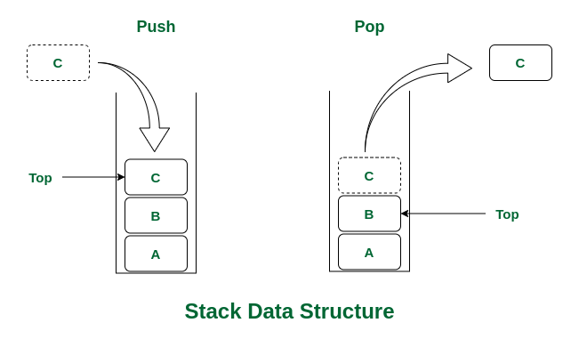
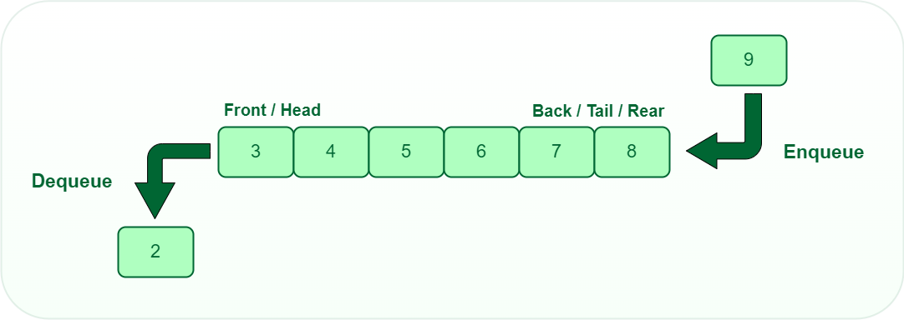

# Data Structures

## Stack Data Structure

### Definition

A stack is a linear data structure that follows the **Last-In-First-Out (LIFO)** principle. This means that the last element added to the stack is the first one to be removed.

### Basic Operations

- **Push**: Adds an element to the top of the stack.
- **Pop**: Removes the element from the top of the stack.
- **Peek** or **Top**: Retrieves the element at the top of the stack without removing it.
- **IsEmpty**: Checks if the stack is empty.
- **Size**: Returns the number of elements in the stack.

### Key Characteristics

- **LIFO Principle**: The most recent element added to the stack is the first one to be removed.
- **Dynamic Size**: Stacks can grow and shrink in size as elements are pushed and popped.
- **One End Access**: Elements are added and removed from only one end, known as the top.

### Visual Representation

#### Explanation of the Visual Representation

In the provided stack diagram:

- **Push Operation**: The left side of the image demonstrates the push operation, where an element `C` is being added to the top of the stack. After the push operation, `C` becomes the topmost element, followed by `B` and `A`.
  
- **Pop Operation**: The right side of the image illustrates the pop operation, where the topmost element `C` is being removed from the stack. After the pop operation, the element `B` becomes the new top of the stack.

The arrows indicate the direction of the operations:
- The downward arrow on the left side signifies adding (pushing) an element onto the stack.
- The upward arrow on the right side signifies removing (popping) an element from the stack.

### Applications

Stacks have a variety of applications in computer science and programming, including:

#### 1. Function Calls in Programming
- **Imagine a Stack of Plates**: When you call a function, it's like placing a new plate on top of a stack. When the function is done, you take the top plate off the stack to return to the previous function.
- **Why It’s Useful**: This way, the computer knows exactly where to return after each function finishes, and it keeps track of variables for each function.

#### 2. Undo Features in Applications
- **Think of Undo as a Stack**: Every time you make a change, it’s like putting a new action on top of a stack. When you hit Undo, the program removes the most recent action from the stack, effectively reversing it.
- **Why It’s Useful**: It lets you go back step-by-step through your actions to correct mistakes or try different options.

#### 3. Navigating Web Browsers
- **Imagine Your Browsing History as a Stack**: Each time you visit a new page, it gets added to the top of the stack. When you press the "Back" button, the browser takes you to the previous page by removing the top entry from the stack.
- **Why It’s Useful**: It allows you to move backward and forward through your browsing history efficiently.

#### 4. Expression Evaluation
- **Think of Postfix as a Stack**: When you encounter a number, you push it onto the stack. When you encounter an operator (like + or *), you pop numbers off the stack, perform the operation, and push the result back on.
- **Why It’s Useful**: It helps in calculating expressions correctly without needing parentheses to indicate operation order.

#### 5. Depth-First Search in Graphs
- **Imagine Exploring Cities**: If you're visiting cities, you might use a stack to remember the cities you need to visit next. You go to a city, push it onto the stack, and continue to the next one until you explore all possibilities.
- **Why It’s Useful**: It ensures you explore one path completely before backtracking and trying other paths, making it easier to find solutions or connections.

#### 6. Syntax Parsing
- **Think of Parsing as a Stack**: When checking code, you push opening symbols (like braces `{`) onto the stack. When you find a closing symbol (like `}`), you pop the corresponding opening symbol from the stack.
- **Why It’s Useful**: It helps ensure that every opening symbol has a matching closing symbol, which is crucial for the code to run correctly.

---

## Queue Data Structure

### Definition

A queue is a linear data structure that follows the **First-In-First-Out (FIFO)** principle. This means that the first element added to the queue is the first one to be removed.

### Basic Operations

- **Enqueue**: Adds an element to the end of the queue.
- **Dequeue**: Removes the element from the front of the queue.
- **Front**: Retrieves the element at the front of the queue without removing it.
- **IsEmpty**: Checks if the queue is empty.
- **Size**: Returns the number of elements in the queue.

### Key Characteristics

- **FIFO Principle**: The first element added to the queue is the first one to be removed.
- **Dynamic Size**: Queues can grow and shrink in size as elements are enqueued and dequeued.
- **Two Ends Access**: Elements are added at the rear (end) and removed from the front (beginning).

### Visual Representation

#### Explanation of the Visual Representation

In the provided queue diagram:

- **Enqueue Operation**: The right side of the image shows the enqueue operation, where an element `9` is being added to the back (tail/rear) of the queue. After the enqueue operation, `9` becomes the last element in the queue.
  
- **Dequeue Operation**: The left side of the image demonstrates the dequeue operation, where the front (head) element `2` is being removed from the queue. After the dequeue operation, `3` becomes the new front element.

The arrows indicate the direction of the operations:
- The rightward arrow on the right side signifies adding (enqueuing) an element to the back of the queue.
- The downward arrow on the left side signifies removing (dequeuing) an element from the front of the queue.

### Types of Queues

- **Simple Queue**: The basic form of a queue that operates on a FIFO basis.
- **Circular Queue**: A more advanced type of queue where the end of the queue wraps around to the beginning, creating a circular structure. This helps in efficiently using space when the queue is implemented using a fixed-size array.
- **Priority Queue**: A type of queue where each element has a priority. Elements with higher priority are dequeued before elements with lower priority, regardless of the order in which they were enqueued.
- **Deque (Double-Ended Queue)**: A queue that allows insertion and deletion of elements from both the front and rear ends.

### Applications

Queues have various applications in computer science and real-world scenarios:

#### 1. Task Scheduling
- **Imagine a Line of People Waiting to Buy Tickets**: When you arrive at a ticket counter, you join the end of the line. The person at the front of the line gets served first, then the next, and so on.
- **Why It’s Useful**: This orderly process ensures that each person gets their turn in the order they arrived. Similarly, in computers, tasks are managed in a queue so that they are processed one after another, fairly and efficiently.

#### 2. Print Queue
- **Think of a Printer Queue**: When you send multiple documents to print, they are placed in a queue. The printer prints each document in the order it was received.
- **Why It’s Useful**: It makes sure that documents are printed in the sequence they were sent, avoiding confusion and ensuring that no document is skipped.

#### 3. Breadth-First Search (BFS)
- **Imagine Exploring a Neighborhood**: If you're exploring a neighborhood and want to visit houses level by level, you first visit all the houses on your street before moving to the next street.
- **Why It’s Useful**: BFS uses a queue to explore nodes or locations in layers, ensuring that you explore each level fully before moving to the next. This method is useful for finding the shortest path in a maze or network.

#### 4. Order Processing Systems
- **Think of an Online Store**: When customers place orders online, the orders are lined up in a queue. The store processes and ships each order in the order they were placed.
- **Why It’s Useful**: It helps manage and fulfill orders fairly and efficiently, ensuring that each customer’s order is handled in the sequence it was received.

#### 5. Customer Service Systems
- **Imagine a Call Center**: When customers call for support, their calls are placed in a queue. Customer service representatives answer the calls one by one, starting with the first call that came in.
- **Why It’s Useful**: It ensures that customers are helped in the order their calls were received, which is fair and organized.

#### 6. Traffic Management
- **Think of a Traffic Light**: When cars are waiting at a traffic light, they form a queue. The light changes, and cars are allowed to move in the order they arrived.
- **Why It’s Useful**: It manages the flow of vehicles smoothly, ensuring that each car gets a chance to move through the intersection.
